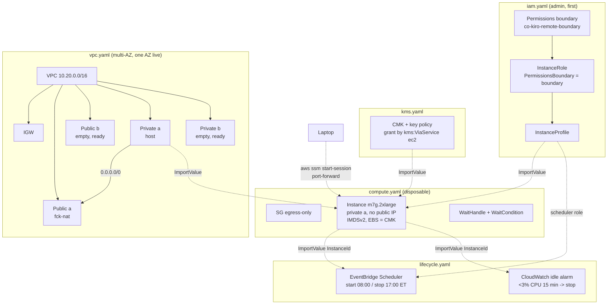

# Design — kiro-remote-crew

## Guiding constraints

Bound by decisions already locked, not open for re-litigation:

- **Never a default VPC.** The project authors its own VPC (IGW, public +
  private subnets, route tables) with a single fck-nat `t4g.nano` for private
  egress.
- **SSM-only, no SSH in V1.** No `AllowSshCidr` parameter, no `SshIngress`
  resource, no key pair. The host security group is egress-only.
- **Permissions boundary as an immutable ceiling**, created once by an admin in
  the IAM template and referenced by ARN.
- **Device-code auth only.** No Secrets Manager secret, no `GetSecretValue`
  grant. `KIRO_API_KEY` is documented, not wired.
- **Default instance tier `m7g.2xlarge`** (arm64, 8 vCPU / 32 GB).

The shipped `kirocrew cloud` reference template (`kirocrew-ec2.yaml`, one stack)
is the source for every resource *shape* — the SSM AMI resolve, IMDSv2
enforcement, the `fail()`/WaitCondition bootstrap contract, the role+boundary
structure. This project keeps those shapes and re-splits them into **five
templates** wired by **cross-stack references** (`Export` + `Fn::ImportValue`),
not nested stacks and not `deploy.sh` parameter-passing — chosen for readability
and because the import dependency enforces deploy order automatically.

## Template layout

| Template | Holds | Depends on |
|---|---|---|
| `infra/iam.yaml` | Permissions boundary (managed policy), instance role, instance profile, scheduler role | — (deploy first) |
| `infra/kms.yaml` | Customer-managed CMK + key policy for EBS encryption | — (independent) |
| `infra/vpc.yaml` | VPC, IGW, multi-AZ subnets (one AZ live), route tables, fck-nat | — (independent) |
| `infra/compute.yaml` | EC2 instance, security group, WaitCondition | imports from iam + kms + vpc |
| `infra/lifecycle.yaml` | Business-hours schedule, idle-stop CloudWatch alarm | imports from compute (InstanceId) + iam (scheduler role) |

Deploy order: `iam → kms → vpc → compute → lifecycle`. `kms` and `vpc` are
independent of `iam` (see the circular-import note below), so only `compute` fans
in from those three; `lifecycle` deploys last because it needs the instance to
exist. Splitting lifecycle out keeps `compute.yaml` a pure "the box and how it's
reached" template and makes the schedule/idle policy independently
editable/tearable without touching the instance stack.

## Architecture overview



Teardown removes `lifecycle` then `compute`; `iam`, `kms`, `vpc` (and the
fck-nat) persist so the box is cheap to recreate.

### Breaking the iam↔kms circular import

With cross-stack `ImportValue`, a naive design deadlocks: the CMK key policy would
name the instance-role ARN (import from iam), while the instance role would need
the CMK ARN for its `kms:Decrypt`/`GenerateDataKey*` grant (import from kms). We
break it so **neither template imports the other**:

- `kms.yaml`'s key policy grants EBS use by **condition**, not by principal ARN:
  allow `kms:Decrypt` / `GenerateDataKey*` / `CreateGrant` to the account root
  **when `kms:ViaService` is `ec2.<region>.amazonaws.com`** and the caller carries
  `aws:PrincipalTag/${TagPrefix}:project = kiro-remote-crew` (default prefix `co`).
  So the CMK never references the role.
- `iam.yaml`'s instance role gets a matching inline `kms` statement scoped to
  `Resource: *` with the same `kms:ViaService` condition (it cannot import the CMK
  ARN, and does not need to — the condition, plus the boundary, bounds it).
- The permissions **boundary** must also permit those `kms` actions under the same
  condition, or the effective-permission intersection would strip them and the
  volume would fail to attach.

Result: `iam` and `kms` deploy in either order; `compute` imports the CMK ARN and
the instance-profile ARN and wires them to the instance.

## `infra/iam.yaml`

**Permissions boundary** — managed policy `${TagPrefix}-kiro-remote-boundary`
(default `co-kiro-remote-boundary`), the ceiling. Two effective grants: (1) the
`AmazonSSMManagedInstanceCore` action set, `Resource: *`; (2) `kms:Decrypt` /
`GenerateDataKey*` / `CreateGrant` gated by `kms:ViaService =
ec2.<region>.amazonaws.com`. Separate-template, admin-created, idempotent — the
anti-circular-protection rationale is unchanged. Sharper least-privilege claim
than the reference template: the box can register with SSM and decrypt its own
volume, and cannot read a single S3 object.

**InstanceRole** — trusts `ec2.amazonaws.com`, attaches
`AmazonSSMManagedInstanceCore`, sets `PermissionsBoundary` to the boundary ARN,
carries the same-conditioned `kms` inline statement. **No**
`secretsmanager:GetSecretValue`, **no** `s3:GetObject` (KiroCrew installs by
public `git clone`, not from an S3 source tarball — see compute UserData). Carries
the `${TagPrefix}:project = kiro-remote-crew` tag so the CMK's `aws:PrincipalTag`
condition matches.

**SchedulerRole** — assumed by `scheduler.amazonaws.com`, scoped to
`ssm:StartAutomationExecution` on the AWS-Start/StopEC2Instance documents +
`ec2:Start/StopInstances` on the instance; consumed by `lifecycle.yaml`.

**InstanceProfile** — wraps the instance role.

**Parameters:** `TagPrefix` (default `co`), plus the tagging params it needs to
set its own tags.

**Exports:** `InstanceProfileArn`, `InstanceRoleArn`, `BoundaryArn`,
`SchedulerRoleArn`.

## `infra/kms.yaml`

- `AWS::KMS::Key` — `EnableKeyRotation: true`, `KeySpec: SYMMETRIC_DEFAULT`,
  `KeyUsage: ENCRYPT_DECRYPT`. Key policy: account-root admin statement, plus the
  condition-scoped EBS-use statement described above — the
  `aws:PrincipalTag/${TagPrefix}:project` condition interpolates the same
  `TagPrefix` parameter as the role's tag, so the two stay in lockstep (no role
  ARN reference).
- `AWS::KMS::Alias` — `alias/${TagPrefix}-kiro-remote-crew` (default
  `alias/co-kiro-remote-crew`).

**Parameters:** `TagPrefix` (default `co`).

**Exports:** `CmkArn`, `CmkAlias`.

**Teaching value:** authoring a key policy, key rotation, and the fact that the
boundary + role + key policy must all agree on the `kms:ViaService` condition or
the encrypted volume silently fails to attach — a concrete "three places must
line up" lesson.

## `infra/vpc.yaml` — multi-AZ, one AZ live

Authored across **two AZs** so the network is production-shaped from day one; only
AZ-a carries workloads in V1.

| Resource | Notes |
|---|---|
| `VPC` | `10.20.0.0/16`, DNS support + hostnames on. |
| `InternetGateway` + attachment | |
| `PublicSubnetA` | `10.20.0.0/20`, `!Select [0, GetAZs]`, holds the fck-nat. |
| `PublicSubnetB` | `10.20.16.0/20`, `!Select [1, GetAZs]`, empty but real. |
| `PrivateSubnetA` | `10.20.128.0/20`, AZ-a, holds the host. |
| `PrivateSubnetB` | `10.20.144.0/20`, AZ-b, empty but real. |
| `PublicRouteTable` + `0.0.0.0/0 -> IGW` + 2 associations | Both public subnets share it. |
| `PrivateRouteTableA` + `0.0.0.0/0 -> FckNat ENI` + assoc | AZ-a private traffic egresses via the NAT. |
| `PrivateRouteTableB` + assoc, **local routes only** | AZ-b private subnet is wired but has no NAT route yet — extending is "add a NAT in b and a default route here," documented inline. |
| `FckNatSecurityGroup` | Ingress from the VPC CIDR only; egress all. |
| `FckNatInstance` | `t4g.nano`, published fck-nat AMI via its SSM public parameter, `SourceDestCheck: false`, public subnet a, public IP. |

This replaces the earlier "commented second NAT" plan: the subnets are real, so a
later multi-AZ extension is additive, not a copy-paste-uncomment.

**Exports:** `VpcId`, `VpcCidr`, `PrivateSubnetAId`, `PrivateSubnetBId`,
`PublicSubnetAId`, `PublicSubnetBId`.

## `infra/compute.yaml`

Modelled on the reference template's instance, SSH removed, private subnet pinned,
imports wired.

**Parameters:** `InstanceType` (default `m7g.2xlarge`), `Architecture` (arm64),
`VolumeSizeGb` (60), `DashboardPort` (5476), `TagPrefix` (default `co`),
`KirocrewRepo`/`KirocrewRef` (public repo / `main` — the sole install source),
and the tagging params (below). **No** `AllowSshCidr`, **no** `AssociatePublicIp`
(pinned false), **no** `SourceBucket`/`SourceKey` (public clone only). Lifecycle
params live in `lifecycle.yaml`.

**Imports:** `InstanceProfileArn` (iam), `CmkArn` (kms), `VpcId` +
`PrivateSubnetAId` (vpc).

**Resources:**
- `InstanceSecurityGroup` — egress-all, zero ingress, in the imported VPC.
- `Instance` — SSM-resolved AL2023 AMI via `ArchToAmiParam`; `NetworkInterfaces[0]`
  with `AssociatePublicIpAddress: false`, the imported private subnet, the SG;
  `MetadataOptions` IMDSv2 required, hop 1; gp3 encrypted root **with
  `KmsKeyId: <imported CmkArn>`**; the UserData bootstrap (unchanged from the
  reference in structure — SELinux-reboot suppression, swap, SHA-pinned Node 22,
  musl kiro-cli, **public `git clone` of `KirocrewRepo`@`KirocrewRef`** (the S3
  source branch is removed), fatal dashboard-build check, systemd unit, health
  poll, `fail()` folds the log tail into the WaitCondition reason).
- `WaitHandle` + `WaitCondition` (`Count 1`, `Timeout 1500`).

**Outputs:** `InstanceId`, `Region`, the `co:developer` value. `InstanceId` is
`Export`ed so `lifecycle.yaml` can import it.

## `infra/lifecycle.yaml`

Everything that keeps the box from running idle. Split out of `compute.yaml` so
the instance stack stays "the box and how it's reached," and the schedule/idle
policy can be edited or torn down on its own. Three complementary mechanisms, all
opt-out; the user can always take manual control:

**Imports:** `InstanceId` (compute), `SchedulerRoleArn` (iam).

**Parameters:** `TagPrefix` (default `co`); `ScheduleEnabled` (default `true`) /
`StartCron` / `StopCron` / `ScheduleTimezone` (business-hours schedule);
`IdleStopEnabled` (default `true`) / `IdleCpuThreshold` / `IdlePeriods` (idle
auto-stop). Two conditions (`HasSchedule`, `HasIdleStop`) gate the resources.

**(a) Business-hours schedule** (created when `ScheduleEnabled=true`):
- `AWS::Scheduler::Schedule` **StartSchedule** — cron `StartCron` (default
  `cron(0 8 ? * MON-FRI *)`) in `ScheduleTimezone` (default `America/New_York`),
  target the SSM `AWS-StartEC2Instance` automation with the imported InstanceId,
  using the imported scheduler role.
- `AWS::Scheduler::Schedule` **StopSchedule** — cron `StopCron` (default
  `cron(0 17 ? * MON-FRI *)`), target `AWS-StopEC2Instance`. The hard 5 PM ET
  backstop that stops a box left running past the workday.

**(b) Idle auto-stop** (created when `IdleStopEnabled=true`): an
`AWS::CloudWatch::Alarm` on the instance's `CPUUtilization`, `< IdleCpuThreshold`
(default 3%) for `IdlePeriods × 5 min` (default 3 periods = **15 minutes**), with
an EC2 **stop action** alarm (`arn:aws:automate:<region>:ec2:stop`) as the target
— no Lambda, no code on the box, native alarm→stop. Rationale for CPU as the idle
signal: Kiro Crew's real work (sub-agent concurrency) is CPU-bound, and an idle
dashboard connection alone barely moves CPU — so `<3% for 15 min` reliably means
"nobody is working," while an active chat or a running sub-agent keeps CPU above
the floor and holds the box up. `docs/architecture.md` notes the known edge (a
long, quiet, single-threaded wait could dip under the floor) and says raise
`IdlePeriods` if a user hits it; a stopped box costs nothing and restarts in
~1 min, so the failure mode is cheap.

**(c) On-demand start/stop** — not a resource: `scripts/start.sh` and
`scripts/stop.sh` (see Scripts). The schedule and the idle alarm both leave the
box in the ordinary `stopped` state those scripts operate on.

The `SchedulerRole` (assumed by `scheduler.amazonaws.com`, scoped to
`ssm:StartAutomationExecution` on the two SSM documents + `ec2:Start/StopInstances`
on this instance) lives in `iam.yaml` and is imported here — keeping "all IAM in
iam.yaml" true. Opt-out: deploy `lifecycle.yaml` with `ScheduleEnabled=false`
and/or `IdleStopEnabled=false`, or simply don't deploy the stack at all; the
`${TagPrefix}:schedule-enabled` instance tag records intent.

**Outputs:** the created schedule/alarm names (diagnostics).

## Tagging strategy

Customer-prefixed keys, all lowercase. The prefix is a **`TagPrefix` parameter**
(default `co` = curiousorbit; `AllowedPattern ^[a-z][a-z0-9]{0,15}$`), so a fork
can retag to its own namespace without editing the templates. Every key is built
as `!Sub "${TagPrefix}:project"` etc. Applied as stack-level tags where the
resource type supports propagation, explicit on the instance for instance-specific
keys. The table shows the default (`co`) rendering.

| Tag key (default) | Applied to | Purpose | Source |
|---|---|---|---|
| `${TagPrefix}:project` → `co:project` | all | `kiro-remote-crew` | fixed |
| `${TagPrefix}:managed-by` → `co:managed-by` | all | `cloudformation` | fixed |
| `${TagPrefix}:environment` → `co:environment` | all | `demo` | param (`Environment`) |
| `${TagPrefix}:owner` → `co:owner` | all | org/email — billing accountability | param (`Owner`) |
| `${TagPrefix}:developer` → `co:developer` | **EC2 instance** | **which developer the box is assigned to** | **required param** (`Developer`) |
| `${TagPrefix}:instance-name` → `co:instance-name` | EC2 instance | human label to tell boxes apart | param |
| `${TagPrefix}:schedule-enabled` → `co:schedule-enabled` | EC2 instance | auto-shutdown opt-out (`true`/`false`) | mirrors `ScheduleEnabled` |
| `Name` | EC2 instance | `kiro-remote-crew-${Developer}` | derived (AWS-reserved console key; kept capitalized — and NOT prefixed — so the console renders it) |

`TagPrefix` must be a parameter in **every** template (iam, kms, vpc, compute,
lifecycle) so the keys stay consistent and — critically — the CMK key policy
condition and the instance role's tag agree (see the circular-import note). It is
NOT a cross-stack import, because a stack tag has to be known at that stack's own
deploy time; `deploy.sh` passes the same `--tag-prefix` (default `co`) to all five.

**The multi-instance answer:** `Developer` is a **required** parameter on
`compute.yaml` — deploy fails without it — and drives both `${TagPrefix}:developer`
and the `Name` tag. The `${TagPrefix}:project` tag on the instance also satisfies
the CMK key policy's `aws:PrincipalTag`/resource-tag condition. Roster query (with
the default prefix):

```
aws ec2 describe-instances \
  --filters "Name=tag:co:project,Values=kiro-remote-crew" \
  --query "Reservations[].Instances[].[InstanceId,Tags[?Key=='co:developer']|[0].Value,State.Name]" \
  --output table
```

→ every box, its assigned developer, and running/stopped state in one command.
(Substitute your prefix for `co` if you changed `TagPrefix`.)

## The device-code auth flow (operational, not a resource)

Unchanged. After `compute` reaches `CREATE_COMPLETE` (gateway healthy, not logged
in): `connect.sh` opens the SSM port-forward → dashboard shows "not signed in" →
a second SSM session runs the kiro-cli device-code login (URL + code, approved in
the user's browser once) → token persists on the EBS volume, surviving stop/start
but not a rebuild. `docs/architecture.md` documents `KIRO_API_KEY` (a Secrets
Manager secret + scoped `GetSecretValue` + reading it in UserData) as the "make it
unattended in production" extension — described, never shipped.

## Scripts (`scripts/*.sh`)

`bash`, `set -euo pipefail`, accept `--profile` / `--region`, preflight-check
`aws` + the SSM Session Manager plugin.

- **`deploy.sh`** — deploy `iam.yaml` (skip boundary if the policy exists),
  `kms.yaml`, `vpc.yaml`, `compute.yaml`, then `lifecycle.yaml`. Takes a
  **required `--developer`** flag (fails early without it) passed as the
  `Developer` parameter, plus optional `--tag-prefix` (default `co`, passed to all
  five stacks so the tag keys and the CMK/role condition stay consistent),
  `--instance-type`, `--environment`, `--owner`, `--no-schedule`, `--no-idle-stop`
  (the last two flow into `lifecycle.yaml`). Cross-stack imports mean the scripts
  do **not** shuttle outputs between stacks — each `aws cloudformation deploy` just
  names its own template; downstream stacks resolve inputs via `Fn::ImportValue` at
  CREATE time. `deploy.sh` still blocks on each stack's `CREATE_COMPLETE` and
  surfaces the host's WaitCondition failure reason.
- **`connect.sh`** — resolve `InstanceId` from the `compute` stack outputs; `aws
  ssm start-session --document-name AWS-StartPortForwardingSession
  --parameters portNumber=<DashboardPort>,localPortNumber=<local>`. `ssm:StartSession`
  only.
- **`start.sh` / `stop.sh`** — on-demand lifecycle: resolve `InstanceId` from the
  `compute` stack outputs, then `aws ec2 start-instances` / `stop-instances`.
  `start.sh` waits for `instance-running` + SSM registration and prints the
  `connect.sh` hint, so a returning user is back in ~1 min without the console or
  the 8 AM schedule. Both are the natural companion to the idle auto-stop — the
  box parks itself, the user un-parks it in one command.
- **`teardown.sh`** — delete the **lifecycle** stack, then the **compute** stack;
  wait for each `DELETE_COMPLETE`; print that iam/kms/vpc (and the fck-nat)
  survive and how to delete them. Order matters: `lifecycle` imports the compute
  InstanceId, so compute cannot be deleted while lifecycle is up — the
  export-in-use check enforces it, the readable safety property of cross-stack
  refs.

## Data model

No application store. Persistent state: (a) CloudFormation stack state, (b) the
CMK, (c) the kiro-cli device-code token on the CMK-encrypted EBS volume. All
disposable — teardown removes compute + its encrypted volume; the token is
re-minted by logging in again; the CMK survives for the next box.

## Testing strategy

- **Local parse-check** every template with `cfn-local-validate` (catches `!Sub`
  dollar-brace mistakes, bad refs, and — importantly here — an export/import name
  mismatch across templates) before any deploy.
- **`shellcheck`** the scripts.
- **Import-order test** — deploy `iam`/`kms`/`vpc`, confirm `compute` resolves all
  `Fn::ImportValue`s and `lifecycle` resolves the InstanceId; confirm `teardown`
  of `compute` is refused while `lifecycle` imports from it (and `vpc` while
  `compute` imports from it).
- **Live smoke test** in co-demo (373530653551, ca-central-1) per
  `docs/verification.md`: `CREATE_COMPLETE` → `describe-instance-information` →
  `connect.sh` → device-code login → run a query on the box → **stop/start and
  re-verify**.
- **CMK check** — `aws ec2 describe-volumes` shows the root volume `Encrypted:true`
  with the CMK's `KmsKeyId`, not `aws/ebs`.
- **Lifecycle checks** — (schedule) invoke the SSM `AWS-StopEC2Instance`
  automation manually and confirm the instance stops, then `start.sh` brings it
  back and the gateway returns via the systemd unit; (idle) drive CPU below the
  threshold for the alarm window and confirm the CloudWatch alarm's EC2 stop action
  fires; (on-demand) `stop.sh` then `start.sh` round-trips the box. Together these
  prove the schedule, the idle alarm, the manual scripts, and reboot-survival.
- **Tag roster check** — the `describe-instances` roster query above returns the
  developer for the box.

## Key decisions & rationale

| Decision | Why |
|---|---|
| Five templates (iam/kms/vpc/compute/lifecycle) | All IAM in one place; CMK isolated; network outlives the disposable host; lifecycle split out so the schedule/idle policy edits and tears down without touching the instance stack. |
| Cross-stack refs, not nested stacks | More readable; import dependency enforces deploy order and blocks unsafe teardown. |
| CMK grants by `kms:ViaService` condition, not role ARN | Breaks the iam↔kms circular import; iam and kms deploy in any order. |
| Multi-AZ subnets, one AZ live | Production-shaped from day one; extending to AZ-b is additive, not uncomment-and-hope. |
| Three lifecycle controls (schedule + idle-stop + on-demand scripts) | 8–5 ET schedule is the backstop; a CloudWatch CPU alarm stops an idle box (<3% for 15 min) with no Lambda; `start.sh`/`stop.sh` give the user instant manual control. A stopped box costs nothing and restarts in ~1 min. |
| `co:`-prefixed lowercase tags, required `Developer` | Multi-instance ownership: one `describe-instances` query maps every box to its developer. |
| fck-nat over NAT Gateway | ~$3/mo vs ~$32/mo; boot egress (dnf/npm/pip + ~600 MB kiro-cli) is real and SSM endpoints don't cover it. |
| Device-code auth only | Zero-support project: free tier, no stored secret, legible failure. |
| Reuse the reference UserData structure | Already correct for AL2023/Graviton — re-deriving reintroduces the exact bugs it already solved. |
| `m7g.2xlarge` default | 16 GB RAM floor; tiers ladder by vCPU (sub-agent concurrency is CPU-bound). |
