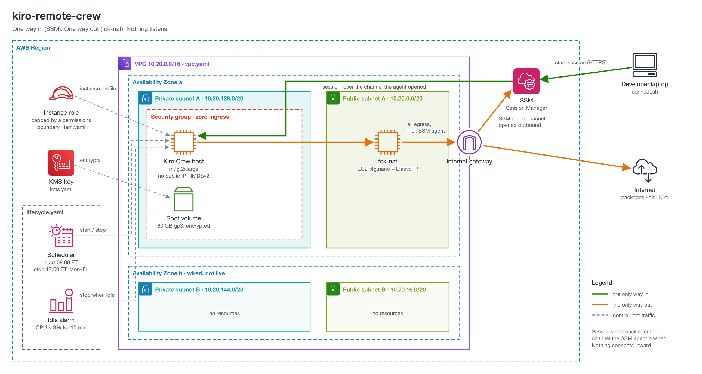

# kiro-remote-crew

Run [Kiro Crew](https://kiro.dev) on a remote AWS EC2 instance and drive it from
your laptop — the agent work executes on the box, not on your Mac. No public IP,
no SSH key, no open inbound ports: access is over AWS SSM Session Manager, so IAM
decides who connects and CloudTrail records it.

Companion build for the *Let's Build* video, hand-built so you can see how the
remote mechanism actually works.

## Why not `kirocrew cloud launch`?

Kiro Crew ships a one-command launcher that also puts the crew on EC2 behind
SSM. It is the right choice for trying Kiro Crew out. This build differs where
it matters for a box you keep:

| | `kirocrew cloud launch` | this repo |
|---|---|---|
| Network | the account's default VPC, so a public subnet and a public IP (no inbound rules) | its own VPC; private subnet, no public IP, egress through one fck-nat |
| Stopping when idle | manual (`kirocrew cloud stop`) | business-hours schedule plus a CPU idle-stop alarm |
| Root volume key | AWS-managed EBS key | customer-managed KMS key with a scoped key policy |
| Install source | your local source, uploaded to S3 (role gets `s3:GetObject`) | public git clone; no S3 access |

Both are SSM-only with zero ingress by default and enforce IMDSv2. The launcher
can target a private subnet with `--subnet`, but you build that network first.
The launcher's permissions boundary is created separately by a different
principal, which is the production pattern; this repo creates it in `iam.yaml`
so the whole build deploys in one pass (see
[`docs/architecture.md`](docs/architecture.md)).

## What it builds



Five CloudFormation stacks, wired by cross-stack `Export` / `Fn::ImportValue`
(not nested stacks — the import dependency enforces deploy order automatically):

- **`infra/iam.yaml`** — the permissions boundary (an immutable ceiling, created
  by an admin as the first stack), the instance role + profile capped by it, and
  the scheduler role `lifecycle.yaml` uses. Two effective grants only: SSM
  Session Manager and EBS-volume KMS use — no S3, no Secrets Manager.
- **`infra/kms.yaml`** — a customer-managed CMK for EBS root-volume encryption.
  Its key policy grants use by `kms:ViaService` **condition** rather than by
  naming the role ARN, so it never imports from `iam.yaml` (breaking what would
  otherwise be a circular cross-stack dependency).
- **`infra/vpc.yaml`** — an explicit VPC (never the default) authored across two
  AZs with only AZ-a live, and a single [fck-nat](https://fck-nat.dev) instance
  (~$7/mo with its public IP vs ~$37/mo plus data for a managed NAT Gateway)
  for private egress.
- **`infra/compute.yaml`** — the EC2 host in the **private** subnet (no public
  IP, egress-only security group, IMDSv2 enforced, CMK-encrypted root), reached
  only over SSM. A WaitCondition fails the stack loudly with the setup-log tail
  if bootstrap breaks.
- **`infra/lifecycle.yaml`** — auto-shutdown, all opt-out: a business-hours
  start/stop schedule, a CloudWatch CPU idle-stop alarm, and the on-demand
  `start.sh`/`stop.sh` scripts. Deploy last (it imports the instance id); simply
  not deploying it is the cleanest opt-out.

Deploy order — `iam → kms → vpc → compute → lifecycle` — is enforced by the
cross-stack imports.

## Quickstart

See [`docs/prerequisites.md`](docs/prerequisites.md), then:

```bash
scripts/deploy.sh --developer alice   # iam -> kms -> vpc -> compute -> lifecycle
scripts/connect.sh                     # SSM port-forward from your laptop
scripts/stop.sh                        # park the box (or let the schedule/idle alarm)
scripts/start.sh                       # un-park it (~1 min)
scripts/teardown.sh                    # remove lifecycle + compute (iam/kms/vpc survive)
```

`--developer` is required — it tags and names the box so a fleet is one
`describe-instances` query away. All scripts accept `--profile`, `--region`, and
`--tag-prefix`. After `deploy.sh`, do the one-time device-code login on the box
(see [`docs/verification.md`](docs/verification.md)).

Running Kiro Crew on your laptop as well? Add the box as a remote instance
instead of using `connect.sh`: see
[`docs/local-kiro-crew.md`](docs/local-kiro-crew.md), including the SSO-expiry
error that `assume` does not fix.

## Cost

About **$14/month** bills whether the box runs or not (fck-nat, its public IP,
the EBS volumes, the KMS key). The default `m7g.2xlarge` adds $0.36 per hour it
runs: about **$85/month** all in at the default schedule's ceiling, less with
idle stop. Priced for ca-central-1; other regions differ. See
[`docs/cost.md`](docs/cost.md) for the breakdown, other instance sizes and the
assumptions.

## License

MIT — see [LICENSE](LICENSE).
